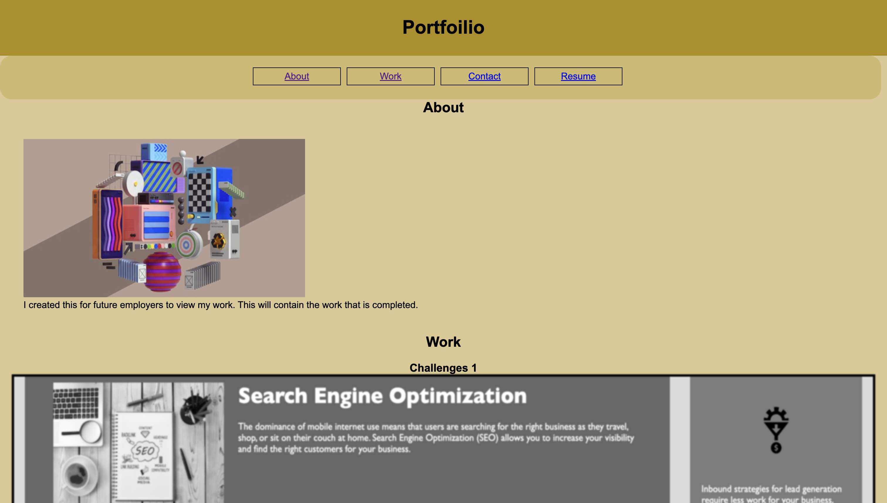
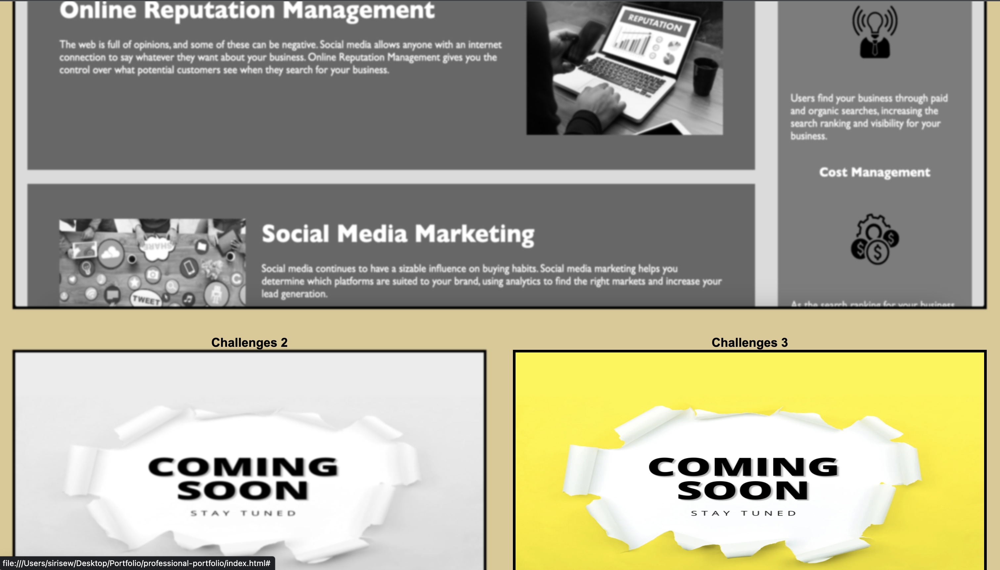

# professional-portfolio

## Description 
I have created a website that include my challenges, resume and contact information. 
It is easy to navigate and and links work well with in. This is in order for future employer to go though my portfolio and navigate throughly with no troubleshoots.

## Screenshots 

## Live URL
[Live URL](https://sirysiu.github.io/professional-portfolio/)
